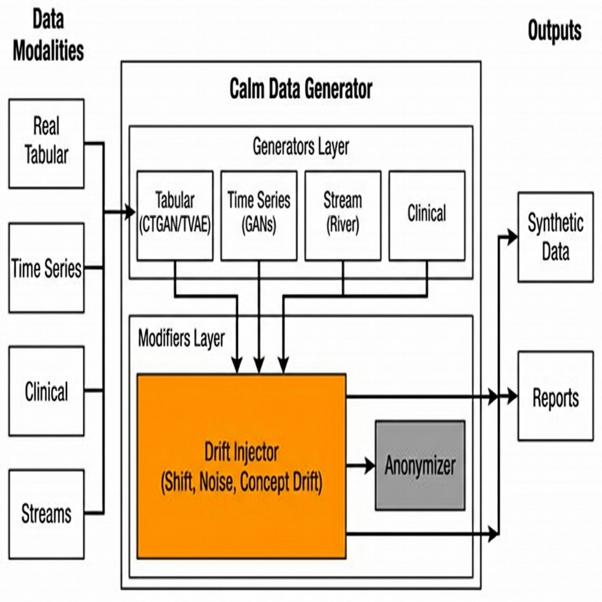
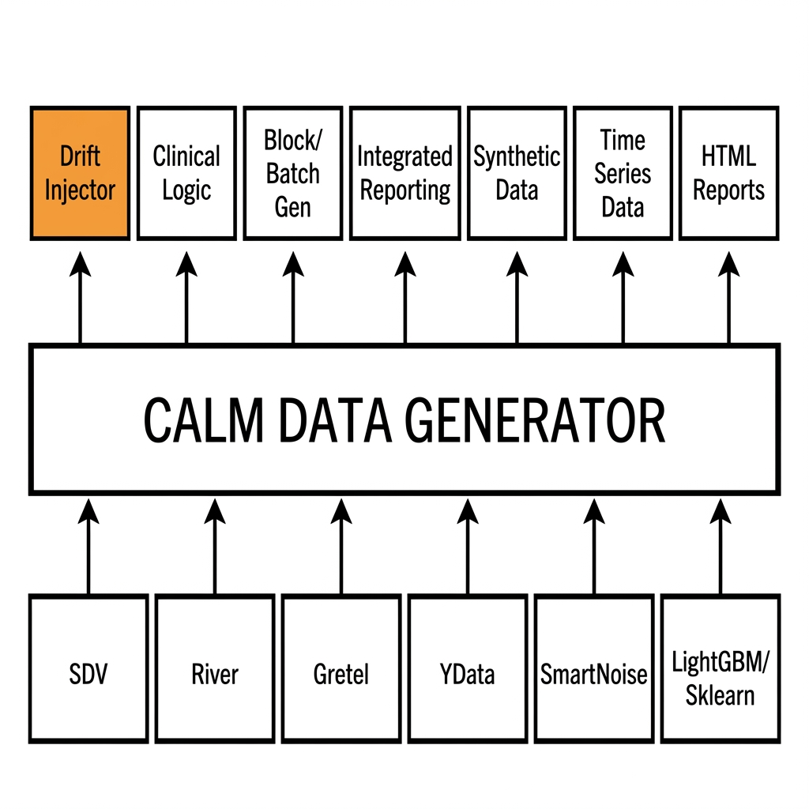

# CALM-Data-Generator


[](https://www.python.org/downloads/)
[](https://opensource.org/licenses/MIT)
[](https://badge.fury.io/py/calm-data-generator)

> 🇪🇸 **[Versión en Español](README_ES.md)**

**CALM-Data-Generator** is a comprehensive Python library for synthetic data generation with advanced features for:
- **Clinical/Medical Data** - Generate realistic patient demographics, genes, proteins
- **Tabular Data Synthesis** - CTGAN, TVAE, Copula, CART, and more
- **Time Series** - TimeGAN, DGAN, PAR, Temporal Copula
- **Drift Injection** - Test ML model robustness with controlled drift
- **Privacy Preservation** - Differential privacy, pseudonymization, generalization
- **Scenario Evolution** - Feature evolution and target construction

## Scope & Capabilities

**Calm-Data-Generator** is optimized for **structured tabular data**. It is designed to handle:
- ✅ **Classification** (Binary & Multi-class)
- ✅ **Regression** (Continuous variables)
- ✅ **Multi-label** problems
- ✅ **Clustering** (Preserving natural groupings)
- ✅ **Time Series** (Temporal correlations and patterns)
- ✅ **Single-Cell / Genomics** (scRNA-seq expression data)

> [!IMPORTANT]
> This library is **NOT** designed for unstructured data such as **Images**, **Videos**, or **Audio**. It does not include Computer Vision or Signal Processing models.

---

## Core Technologies

This library leverages and unifies best-in-class open-source tools to provide a seamless data generation experience:

- **SDV (Synthetic Data Vault)**: The core engine for tabular deep learning models (CTGAN, TVAE) and statistical methods (Copula). **Included by default**.
  > **Note:** SDV versions 1.0+ use the Business Source License (BSL). While free for development and research, commercial production use may require a license from DataCebo. Please review their terms.
- **River**: Powers the streaming generation capabilities (`[stream]` extra).
- **Gretel Synthetics**: Provides advanced time-series generation via DoppelGANger (`[timeseries]` extra).
- **YData Profiling**: Generates comprehensive automated quality reports.
- **SmartNoise**: Enables differential privacy mechanisms.

## Safe Data Sharing

A key advantage of **Calm-Data-Generator** is enabling the use of private data in public or collaborative environments:

1.  **Private Origin**: You start with sensitive data (e.g., GDPR/HIPAA restricted) that cannot leave your secure environment.
2.  **Synthetic Twin**: The library generates a synthetic dataset that statistically mirrors the original but contains **no real individuals**.
3.  **Safe Distribution**: Once validated (using `QualityReporter`'s privacy checks), this synthetic dataset allows for **risk-free sharing**, model training, and testing without exposing confidential information.

## Key Use Cases

- **MLOps Monitoring Validation**: Use **StreamGenerator** and **DriftInjector** to simulate data drift (gradual, abrupt) and verify if your monitoring alerts trigger correctly before deployment.
- **Biomedical Research (HealthTech)**: Generate synthetic patient cohorts with **ClinicalDataGenerator** that preserve complex biological correlations (e.g., gene-age relationships) for collaborative studies without compromising patient privacy.
- **Stress Testing ("What-If" Analysis)**: Use **ScenarioInjector** to simulate future scenarios (e.g., "What if the customer age base increases by 10 years?") and measure model performance degradation under stress.
- **Development Data**: Provide developers with high-fidelity synthetic replicas of production databases, allowing them to build and test features safely without accessing sensitive real-world data.

---

## Architecture & Design

### Technical Architecture
Minimalist view of the system's core components and data flow.



### Ecosystem Integration
How **Calm Data Generator** integrates with foundational libraries to provide enhanced value (Drift, Clinical Logic, Reporting).



---

## Installation

```bash
# Basic installation
pip install calm-data-generator

# For Stream Generator (River)
pip install calm-data-generator[stream]

# For Time Series (Gretel Synthetics)
pip install calm-data-generator[timeseries]

# Full installation
pip install calm-data-generator[full]
```

**From source:**
```bash
git clone https://github.com/AlejandroBeldaFernandez/Calm-Data_Generator.git
cd Calm-Data_Generator
pip install .
```

### Troubleshooting

**Zsh shell (macOS/Linux):** If brackets cause errors, use quotes:
```bash
pip install "calm-data-generator[stream]"
```

**River compilation errors (Linux/macOS):**
```bash
# Ubuntu/Debian
sudo apt install build-essential python3-dev

# macOS
xcode-select --install

# Then retry
pip install calm-data-generator
```

**Windows users:** Install Visual Studio Build Tools first:
1. Download [Visual Studio Build Tools](https://visualstudio.microsoft.com/visual-cpp-build-tools/)
2. Install "Desktop development with C++"
3. Then retry installation

**PyTorch CPU-only (no GPU):**
```bash
pip install torch --index-url https://download.pytorch.org/whl/cpu
pip install calm-data-generator
```

**Dependency conflicts:** Use a clean virtual environment:
```bash
python -m venv venv
source venv/bin/activate  # Linux/macOS
# or: venv\Scripts\activate  # Windows
pip install calm-data-generator
```

---

## Quick Start

### Generate Synthetic Data from Real Dataset

```python
from calm_data_generator import RealGenerator
import pandas as pd

# Your real dataset
data = pd.read_csv("your_data.csv")

# Initialize generator
gen = RealGenerator()

# Generate 1000 synthetic samples using CTGAN
# model_params accepts any hyperparameter supported by the underlying model
synthetic = gen.generate(
    data=data,
    n_samples=1000,
    method='ctgan',
    target_col='label',
    model_params={
        'epochs': 300,           # Training epochs
        'batch_size': 500,       # Batch size
        'discriminator_steps': 1 # CTGAN-specific parameter
    }
)

print(f"Generated {len(synthetic)} samples")
```

### GPU Acceleration

**Methods with GPU support:**

| Method | GPU Support | Parameter |
|--------|-------------|-----------|
| `ctgan`, `tvae`, `copula` | ✅ CUDA/MPS | `enable_gpu=True` |
| `par` (time series) | ✅ CUDA/MPS | `enable_gpu=True` |
| `dgan` (DoppelGANger) | ✅ PyTorch | Auto-detected |
| `diffusion` | ✅ PyTorch | Auto-detected |
| `smote`, `adasyn`, `cart`, `rf`, `lgbm`, `gmm`, `dp`, `datasynth` | ❌ CPU only | - |

```python
synthetic = gen.generate(
    data=data,
    n_samples=1000,
    method='ctgan',
    model_params={
        'epochs': 300,
        'enable_gpu': True  # Explicit GPU - auto-detected by default
    }
)
```

> **Note:** Requires PyTorch with CUDA support:
> ```bash
> pip install torch --index-url https://download.pytorch.org/whl/cu118
> ```

### Generate Clinical Data

```python
from calm_data_generator import ClinicalDataGenerator
from calm_data_generator.generators.configs import DateConfig

gen = ClinicalDataGenerator()

# Generate patient data with genes and proteins
result = gen.generate(
    n_samples=100,
    n_genes=500,
    n_proteins=200,
    date_config=DateConfig(start_date="2024-01-01")
)

demographics = result['demographics']
genes = result['genes']
proteins = result['proteins']
```

### Inject Drift for ML Testing

**Option 1: Directly from `generate()` (recommended)**

```python
from calm_data_generator import RealGenerator

gen = RealGenerator()

# Generate synthetic data WITH drift in one call
synthetic = gen.generate(
    data=real_data,
    n_samples=1000,
    method='ctgan',
    target_col='label',
    drift_injection_config=[
        {
            "method": "inject_drift",
            "params": {
                "columns": ["age", "income", "label"],
                "drift_mode": "gradual", # Auto-detects column types
                "drift_magnitude": 0.3,
                "center": 500,
                "width": 200
            }
        }
    ]
)
```

**Option 2: Standalone DriftInjector**

```python
from calm_data_generator import DriftInjector

injector = DriftInjector()

# Unified drift injection (auto-detects types)
drifted_data = injector.inject_drift(
    df=data,
    columns=['feature1', 'feature2', 'status'],
    drift_mode='gradual',
    drift_magnitude=0.5,
    # Optional specific configs
    numeric_operation='shift',
    categorical_operation='frequency',
    boolean_operation='flip'
)
```
```

**Available drift methods:** `inject_feature_drift`, `inject_feature_drift_gradual`, `inject_feature_drift_incremental`, `inject_feature_drift_recurrent`, `inject_label_drift`, `inject_concept_drift`, `inject_categorical_frequency_drift`, and more. See [DRIFT_INJECTOR_REFERENCE.md](calm_data_generator/docs/DRIFT_INJECTOR_REFERENCE.md).

### Single-Cell / Gene Expression Data

Generate synthetic single-cell RNA-seq-like data using specialized VAE models:

```python
from calm_data_generator import RealGenerator

gen = RealGenerator()

# scVI: Generate new cells from scratch
synthetic = gen.generate(
    data=expression_df,      # Rows=cells, Columns=genes
    n_samples=1000,
    method='scvi',
    target_col='cell_type',
    model_params={'epochs': 100, 'n_latent': 10}
)

# scGen: Generate cells under different conditions
synthetic = gen.generate(
    data=expression_df,
    n_samples=1000,
    method='scgen',
    target_col='cell_type',
    model_params={
        'epochs': 100,
        'condition_col': 'treatment'  # Required for scGen
    }
)
```

| Method | Use Case |
|--------|----------|
| `scvi` | Generate new cells from learned distribution |
| `scgen` | Perturbation prediction, batch effect removal |

### Stream Data Generation

```python
from calm_data_generator import StreamGenerator

stream_gen = StreamGenerator()

# Generate a data stream with Concept Drift
stream_data = stream_gen.generate(
    n_chunks=10,
    chunk_size=1000,
    concept_drift=True,  # Simulate concept drift over time
    n_features=10
)

print(f"Generated stream with {len(stream_data)} total samples")
```

### Quality Reporting

```python
from calm_data_generator import QualityReporter

# Generate a quality report comparing real vs synthetic data
reporter = QualityReporter()

reporter.generate_report(
    real_data=data,
    synthetic_data=synthetic,
    output_dir="./quality_report",
    target_col="target"
)
# Report saved to ./quality_report/report.html
```

---

## Modules

| Module | Import | Description |
|--------|--------|-------------|
| **Tabular** | `generators.tabular` | RealGenerator, QualityReporter |
| **Clinical** | `generators.clinical` | ClinicalDataGenerator, ClinicalDataGeneratorBlock |
| **Stream** | \`generators.stream\` | StreamGenerator, StreamBlockGenerator |
| **Blocks** | `generators.tabular` | RealBlockGenerator |
| **Drift** | `generators.drift` | DriftInjector |
| **Dynamics** | `generators.dynamics` | ScenarioInjector |
| **Anonymizer** | `anonymizer` | Privacy transformations |
| **Reports** | `reports` | Visualizer |

---

## Synthesis Methods

| Method | Type | Description | Requirements / Notes |
|--------|------|-------------|----------------------|
| `cart` | ML | CART-based iterative synthesis (fast) | Base installation |
| `rf` | ML | Random Forest synthesis | Base installation |
| `lgbm` | ML | LightGBM-based synthesis | Base installation (Requires `lightgbm`) |
| `ctgan` | DL | Conditional GAN for tabular data | Requires `sdv` (heavy DL dep) |
| `tvae` | DL | Variational Autoencoder | Requires `sdv` (heavy DL dep) |
| `copula` | Statistical | Gaussian Copula | Base installation |
| `diffusion` | DL | Tabular Diffusion (DDPM) | **Experimental**. Requires `calm-data-generator[deeplearning]` |
| `smote` | Augmentation | SMOTE oversampling | Base installation |
| `adasyn` | Augmentation | ADASYN adaptive sampling | Base installation |
| `dp` | Privacy | Differential Privacy (PATE-CTGAN) | Requires `smartnoise-synth` |
| `timegan` | Time Series | TimeGAN for sequences | **Manual Install**. Requires `ydata-synthetic` & `tensorflow` (conflicts likely) |
| `dgan` | Time Series | DoppelGANger | Requires `calm-data-generator[timeseries]` (`gretel-synthetics`) |
| `par` | Time Series | Probabilistic AutoRegressive | Requires `sdv` |
| `copula_temporal` | Time Series | Gaussian Copula with temporal lags | Base installation |
| `gmm` | Statistical | Gaussian Mixture Models | Base installation |
| `datasynth` | Statistical | DataSynthesizer (Greedy Bayes) | Requires `DataSynthesizer` |
| `scvi` | Single-Cell | scVI (Variational Inference) for RNA-seq | Requires `scvi-tools` |
| `scgen` | Single-Cell | scGen (Perturbation prediction) | Requires `scvi-tools` |

---

## CLI Access

```bash
# List all tutorials
calm-data-generator tutorials

# Show a specific tutorial
calm-data-generator tutorials show 1

# Run a tutorial
calm-data-generator tutorials run 1

# Show version
calm-data-generator version
```

---

## Tutorials

| # | Tutorial | Description |
|---|----------|-------------|
| 1 | Real Generator | Tabular data synthesis |
| 2 | Clinical Generator | Clinical/medical data |
| 3 | Drift Injector | Drift injection for ML |
| 4 | Stream Generator | Stream-based generation |
| 5 | Privacy | Privacy transformations |
| 6 | Scenario Injector | Feature evolution |

---

## Documentation Index

Explore the full documentation in the `calm_data_generator/docs/` directory:

| Document | Description |
|----------|-------------|
| **[DOCUMENTATION.md](calm_data_generator/docs/DOCUMENTATION.md)** | **Main User Guide**. Comprehensive manual covering all modules, concepts, and advanced usage. |
| **[REAL_GENERATOR_REFERENCE.md](calm_data_generator/docs/REAL_GENERATOR_REFERENCE.md)** | **API Reference for `RealGenerator`**. Detailed parameters for all synthesis methods (`ctgan`, `lgbm`, `scvi`, etc.). |
| **[DRIFT_INJECTOR_REFERENCE.md](calm_data_generator/docs/DRIFT_INJECTOR_REFERENCE.md)** | **API Reference for `DriftInjector`**. Guide to using `inject_drift` and specialized drift capabilities. |
| **[STREAM_GENERATOR_REFERENCE.md](calm_data_generator/docs/STREAM_GENERATOR_REFERENCE.md)** | **API Reference for `StreamGenerator`**. Details on stream simulation and drift integration. |
| **[CLINICAL_GENERATOR_REFERENCE.md](calm_data_generator/docs/CLINICAL_GENERATOR_REFERENCE.md)** | **API Reference for `ClinicalGenerator`**. Configuration for genes, proteins, and patient data. |
| **[API.md](calm_data_generator/docs/API.md)** | **Technical API Index**. High-level index of classes and functions. |

---

## License

MIT License - see [LICENSE](LICENSE) file

---

