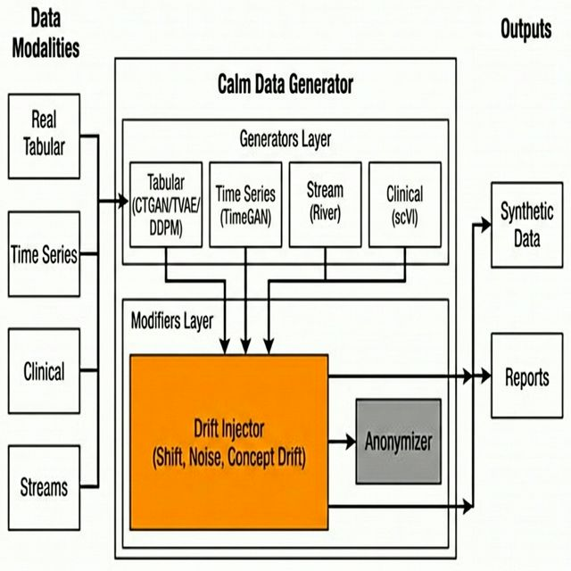

# CALM-Data-Generator

[](https://www.python.org/downloads/)
[](https://opensource.org/licenses/MIT)
[](https://pypi.org/project/calm-data-generator/)
[](https://pypi.org/project/calm-data-generator/)

> 🚀 **¡Ya disponible en PyPI!** Instalar con: `pip install calm-data-generator`

> 🇬🇧 **[English README](README.md)**

**CALM-Data-Generator** es una biblioteca completa en Python para la generación de datos sintéticos con características avanzadas para:
- **Datos Clínicos/Médicos** - Genera demografía de pacientes, genes y proteínas realistas.
- **Síntesis Tabular** - CTGAN, TVAE, CART y más.
- **Series Temporales** - TimeGAN, DGAN
- **Single-Cell** - scVI, GEARS (Predicción de Perturbaciones)
- **Inyección de Drift (Desviación)** - Prueba la robustez de modelos ML con drift controlado.
- **Preservación de Privacidad** - Privacidad diferencial, pseudonimización, generalización.
- **Evolución de Escenarios** - Evolución de features y construcción de targets.




## Alcance y Capacidades

**Calm-Data-Generator** está optimizado para **datos tabulares estructurados**. Está diseñado para manejar:
- ✅ **Clasificación** (Binaria y Multiclase)
- ✅ **Regresión** (Variables continuas)
- ✅ **Multi-label** (Múltiples objetivos)
- ✅ **Clustering** (Preservación de agrupamientos naturales)
- ✅ **Series Temporales** (Correlaciones y patrones temporales)
- ✅ **Single-Cell / Genómica** (Datos de expresión RNA-seq)

> [!IMPORTANT]
> Esta biblioteca **NO** está diseñada para datos no estructurados como **Imágenes**, **Vídeos** o **Audio**. No incluye modelos de Visión Artificial o Procesamiento de Señales.

---

## ¿Qué hace única a esta librería?

**CALM-Data-Generator** no es solo otra herramienta de datos sintéticos, es un **ecosistema unificado** que reúne las mejores librerías de código abierto bajo una API única y consistente:

### 🔗 Integración Unificada Multi-Librería
En lugar de aprender y gestionar múltiples librerías complejas por separado, CALM-Data-Generator proporciona:
- **Una sola API** para 15+ métodos de síntesis de diferentes fuentes (Synthcity, scvi-tools, GEARS, imbalanced-learn, etc.)
- **Interoperabilidad fluida** entre generadores tabulares, series temporales, streaming y datos genómicos
- **Configuración consistente** en todos los métodos con validación automática de parámetros
- **Reportes integrados** con YData Profiling para todos los métodos de generación

### 🌊 Inyección Avanzada de Drift (Líder en la Industria)
El módulo **DriftInjector** es una de las herramientas de simulación de drift más completas disponibles:
- **14+ tipos de drift**: Drift de características (gradual, abrupto, incremental, recurrente), drift de etiquetas, concept drift, correlation drift, inyección de outliers, y más
- **Drift consciente de correlaciones**: Propaga drift realista a través de características correlacionadas (ej. aumentar ingresos → aumentar gastos)
- **Perfiles de drift multi-modales**: Transiciones sigmoid, lineales, coseno para drift gradual
- **Drift condicional**: Aplica drift solo a subconjuntos específicos de datos basándose en reglas de negocio
- **Integrado con generadores**: Inyecta drift directamente durante la síntesis o post-hoc sobre datos existentes
- **Perfecto para MLOps**: Prueba monitorización de data drift, detección de concept drift, y robustez de modelos antes de producción

> **En resumen**: Mientras otras herramientas se enfocan en un solo enfoque (ej. solo GANs, solo métodos estadísticos), CALM-Data-Generator **unifica el ecosistema** y añade **simulación de drift de grado de producción** que la mayoría de librerías no ofrecen.

---

## Tecnologías Principales

Esta biblioteca aprovecha y unifica las mejores herramientas de código abierto para proporcionar una experiencia de generación de datos fluida:

- **Synthcity**: El motor principal para modelos tabulares de deep learning (CTGAN, TVAE) y privacidad. **Incluido por defecto**.
- **River**: Potencia las capacidades de generación en streaming (`[stream]` extra).
- **YData Profiling**: Genera informes de calidad automatizados y completos.

## ⚡ Presets (Plantillas)

**Calm-Data-Generator** incluye un conjunto de **Presets** diseñados para darte una ventaja inicial. Son configuraciones predefinidas para casos de uso comunes.

> [!TIP]
> **Los Presets son Puntos de Partida**: Están pensados para ser usados como **base**. Debes importar un preset, modificarlo para que se ajuste a tus datos específicos (ej. cambiar columnas, ajustar umbrales) y luego pasarlo al generador.

### Presets Disponibles
Ubicados en `calm_data_generator/presets/`, fáciles de importar e iterar:

- **`FastPrototypePreset`**: Optimizado para velocidad (menos épocas, modelos simples) para probar pipelines rápidamente.
- **`HighFidelityPreset`**: Ajustado para máxima calidad (CTGAN/TVAE con más entrenamiento) para datos de producción.
- **`ClinicalDataGenerator`**: Especializado para datos de salud (demografía + ómicas).
- **`ImbalancePreset`**: Configurado para manejar y rebalancear datasets muy desbalanceados.
- **`TimeSeriesPreset`**: Configuración para generación de datos secuenciales.

**Ejemplo de Uso:**
```python
from calm_data_generator.presets import FastPrototypePreset
from calm_data_generator import RealGenerator

# 1. Cargar la configuración del preset
config = FastPrototypePreset

# 2. Modificarla para tu caso específico
config["epochs"] = 50  # Sobrescribir valor por defecto

# 3. Usarlo
gen = RealGenerator()
gen.generate(data, **config)
```

## Librerías Clave y Ecosistema
 
 | Librería | Rol | Uso en Calm-Data-Generator |
 | :--- | :--- | :--- |
 | **Synthcity** | Motor de Deep Learning | Potencia `CTGAN`, `TVAE`, `DDPM`, `TimeGAN`. Manejo de privacidad y fidelidad. |
 | **scvi-tools** | Análisis Single-Cell | Potencia el método `scvi` para datos genómicos/transcriptómicos de alta dimensión. |
 | **River** | Streaming ML | Potencia `StreamGenerator` para simulación de concept drift y flujo de datos en tiempo real. |
 | **YData Profiling**| Reportes | Genera reportes de calidad automatizados (`QualityReporter`). |
 | **Pydantic** | Validación | Asegura chequeo de tipos estricto y gestión de configuración. |
 | **PyTorch** | Backend | Computación tensorial subyacente para todos los modelos de deep learning. |
 | **Copulae** | Modelado Estadístico | Potencia el método `copula` para modelado de dependencia multivariante. |

## Intercambio Seguro de Datos

Una ventaja clave de **Calm-Data-Generator** es permitir el uso de datos privados en entornos públicos o colaborativos:

1.  **Origen Privado**: Empiezas con datos sensibles (ej. restringidos por GDPR/HIPAA) que no pueden salir de tu entorno seguro.
2.  **Gemelo Sintético**: La biblioteca genera un conjunto de datos sintético que refleja estadísticamente el original pero **no contiene individuos reales**.
3.  **Distribución Segura**: Una vez validado (usando los chequeos de privacidad de `QualityReporter`), este dataset sintético permite **compartir sin riesgos**, entrenar modelos y realizar pruebas sin exponer información confidencial.

## Casos de Uso Clave

- **Validación de Monitorización MLOps**: Usa **StreamGenerator** y **DriftInjector** para simular drift de datos (gradual, abrupto) y verificar si tus alertas de monitorización se activan correctamente antes del despliegue.
- **Investigación Biomédica (HealthTech)**: Genera cohortes de pacientes sintéticos con **ClinicalDataGenerator** que preservan correlaciones biológicas complejas (ej. relaciones gen-edad) para estudios colaborativos sin comprometer la privacidad del paciente.
- **Pruebas de Estrés (Análisis "What-If")**: Usa **ScenarioInjector** para simular escenarios futuros (ej. "¿Qué pasa si la base de clientes envejece 10 años?") y medir la degradación del rendimiento del modelo bajo estrés.
- **Drift con Correlaciones**: Inyecta drift que se propaga realisticamente a características correlacionadas (ej. aumentar ingresos también aumenta gastos proporcionalmente) usando el parámetro `correlations=True`.
- **Datos de Desarrollo**: Proporciona a los desarrolladores réplicas sintéticas de alta fidelidad de bases de datos de producción, permitiéndoles construir y probar funcionalidades de forma segura sin acceder a datos reales sensibles.

---

## Instalación
 
 > [!WARNING]
 > **Aviso Importante**: Esta librería depende de frameworks de Deep Learning pesados como `PyTorch`, `Synthcity` y librerías `CUDA`.
 > La instalación puede ser **pesada (~2-3 GB)** y tardar unos minutos dependiendo de tu conexión. Recomendamos encarecidamente usar un entorno virtual limpio.
 
 ### 🔄 Estrategia de Versiones
 
 - **GitHub (Recomendado para últimas novedades)**: La rama `main` contiene la versión más actualizada con los últimos arreglos y funcionalidades.
 - **PyPI (Estable)**: Las versiones en PyPI son estables y se actualizan con menor frecuencia para cambios mayores.
 
 ### Instalación Estándar (PyPI - Estable)
 La librería está disponible en PyPI. Para una experiencia estable, recomendamos usar un entorno virtual:

```bash
# 1. Crear y activar el entorno virtual
python3 -m venv venv
source venv/bin/activate

# 2. Actualizar pip, setuptools y wheel (Crucial para una instalación exitosa)
pip install --upgrade pip setuptools wheel

# 3. Instalar la librería (optimizada para velocidad)
pip install calm-data-generator
```

### Extras de Instalación
Puedes añadir capacidades específicas según tu caso de uso:
```bash
# Para Stream Generator (River)
pip install "calm-data-generator[stream]"


# Instalación completa
pip install "calm-data-generator[full]"
```

> [!NOTE]
> **Nota de Rendimiento**: Hemos optimizado el árbol de dependencias en la versión 1.0.0 bloqueando versiones específicas de `pydantic`, `xgboost` y `cloudpickle`. Esto reduce drásticamente el tiempo de instalación inicial, de unos ~40 minutos a solo un par de minutos. 🚀

**Desde fuente (GitHub - Últimas Actualizaciones):**
Usa este método para obtener los últimos arreglos y funcionalidades aún no disponibles en PyPI.

```bash
# Opción A: Instalar directamente desde GitHub
pip install git+https://github.com/AlejandroBeldaFernandez/Calm-Data_Generator.git

# Opción B: Clonar e instalar (para desarrollo)
git clone https://github.com/AlejandroBeldaFernandez/Calm-Data_Generator.git
cd Calm-Data_Generator
pip install .
```

### Solución de Problemas

**Zsh shell (macOS/Linux):** Si los corchetes dan error, usa comillas:
```bash
pip install "calm-data-generator[stream]"
```

**Errores de compilación de River (Linux/macOS):**
```bash
# Ubuntu/Debian
sudo apt install build-essential python3-dev

# macOS
xcode-select --install

# Luego reintenta
pip install calm-data-generator
```

**Usuarios de Windows:** Instala Visual Studio Build Tools primero:
1. Descarga [Visual Studio Build Tools](https://visualstudio.microsoft.com/visual-cpp-build-tools/)
2. Instala "Desktop development with C++"
3. Luego reintenta la instalación

**PyTorch solo-CPU (sin GPU):**
```bash
pip install torch --index-url https://download.pytorch.org/whl/cpu
pip install calm-data-generator
```

---

## Inicio Rápido

### Generar Datos Sintéticos desde un Dataset Real

```python
from calm_data_generator import RealGenerator
import pandas as pd

# Tu dataset real (puede ser un DataFrame, ruta a .csv, .h5 o .h5ad)
data = pd.read_csv("your_data.csv")  # o "your_data.h5ad"

# Inicializar generador
gen = RealGenerator()

# Generar 1000 muestras sintéticas usando CTGAN

synthetic = gen.generate(
    data=data,
    n_samples=1000,
    method='ctgan',
    target_col='label',
    epochs=300, 
    batch_size=500,
    discriminator_steps=1
   
)

print(f"Generadas {len(synthetic)} muestras")
```

### Aceleración por GPU

**Métodos con soporte GPU:**

| Método | Soporte GPU | Parámetro |
|--------|-------------|-----------|
| `ctgan`, `tvae` | ✅ CUDA/MPS | `enable_gpu=True` |
| `diffusion` | ✅ PyTorch | Auto-detectado |
| `ddpm` | ✅ PyTorch + Synthcity | Auto-detectado |
| `timegan` | ✅ PyTorch + Synthcity | Auto-detectado |
| `timevae` | ✅ PyTorch + Synthcity | Auto-detectado |


| `smote`, `adasyn`, `cart`, `rf`, `lgbm`, `gmm`, `copula` | ❌ Solo CPU | - |

```python
synthetic = gen.generate(
    data=data,
    n_samples=1000,
    method='ctgan',
    epochs=300, 
    enable_gpu=True,
   
)
```

### Generar Datos Clínicos

```python
from calm_data_generator import ClinicalDataGenerator
from calm_data_generator.generators.configs import DateConfig

gen = ClinicalDataGenerator()

# Generar datos de pacientes con genes y proteínas
result = gen.generate(
    n_samples=100,
    n_genes=500,
    n_proteins=200,
    date_config=DateConfig(start_date="2024-01-01")
)

demographics = result['demographics']
genes = result['genes']
proteins = result['proteins']
```

### Inyectar Drift para Pruebas de ML

**Opción 1: Directamente desde `generate()` (recomendado)**

```python
from calm_data_generator import RealGenerator

gen = RealGenerator()

# Generar datos sintéticos CON drift en una sola llamada
synthetic = gen.generate(
    data=real_data,
    n_samples=1000,
    method='ctgan',
    target_col='label',
    drift_injection_config=[
        {
            "method": "inject_drift",
            "params": {
                "columns": ["age", "income", "label"],
                "drift_mode": "gradual", # Auto-detecta tipos de columna
                "drift_magnitude": 0.3,
                "center": 500,
                "width": 200
            }
        }
    ]
)
```

**Opción 2: DriftInjector Independiente**

```python
from calm_data_generator import DriftInjector

injector = DriftInjector()

# Inyección unificada de drift (auto-detecta tipos)
drifted_data = injector.inject_drift(
    df=data,
    columns=['feature1', 'feature2', 'status'],
    drift_mode='gradual',
    drift_magnitude=0.5,
    # Configuración específica opcional
    numeric_operation='shift',
    categorical_operation='frequency',
    boolean_operation='flip'
)
```

**Métodos de drift disponibles:** `inject_drift` (unificado), `inject_feature_drift_gradual`, `inject_label_drift`, `inject_categorical_frequency_drift`, y más. Ver [DRIFT_INJECTOR_REFERENCE.md](calm_data_generator/docs/DRIFT_INJECTOR_REFERENCE.md).

### Simulación de Streaming

```python
from calm_data_generator import StreamGenerator

# Simular un stream de datos basándose en el dataset real
stream_gen = StreamGenerator()

stream_data = stream_gen.generate(
    data=data,
    n_samples=5000,
    chunk_size=1000,
    concept_drift=True,  # Simular concept drift en el tiempo
    n_features=10
)

print(f"Generado stream con {len(stream_data)} muestras totales")
```

### Informe de Calidad

```python
from calm_data_generator import QualityReporter

# Generar informe comparando datos reales vs sintéticos
reporter = QualityReporter()

reporter.generate_report(
    real_data=data,
    synthetic_data=synthetic,
    output_dir="./quality_report",
    target_col="target"
)
# Informe guardado en ./quality_report/report.html
```

---

## Módulos

| Módulo | Importación | Descripción |
|--------|-------------|-------------|
| **Tabular** | `generators.tabular` | RealGenerator, QualityReporter |
| **Clinical** | `generators.clinical` | ClinicalDataGenerator, ClinicalDataGeneratorBlock |
| **Stream** | \`generators.stream\` | StreamGenerator, StreamBlockGenerator |
| **Blocks** | `generators.tabular` | RealBlockGenerator |
| **Drift** | `generators.drift` | DriftInjector |
| **Dynamics** | `generators.dynamics` | ScenarioInjector |
| **Reports** | `reports` | Visualizer |

---

## Métodos de Síntesis

| Método | Tipo | Descripción | Requisitos / Notas |
|--------|------|-------------|-------------------|
| `cart` | ML | Síntesis iterativa basada en CART (rápido) | Instalación base |
| `rf` | ML | Síntesis con Random Forest | Instalación base |
| `lgbm` | ML | Síntesis basada en LightGBM | Instalación base (Requiere `lightgbm`) |
| `ctgan` | DL | GAN Condicional para datos tabulares | Requiere `synthcity` |
| `tvae` | DL | Autoencoder Variacional | Requiere `synthcity` |
| `diffusion` | DL | Difusión Tabular (custom, rápida) | Instalación base (PyTorch) |
| `ddpm` | DL | Synthcity TabDDPM (avanzado) | Requiere `synthcity` |
| `timegan` | Series Temp. | TimeGAN para datos secuenciales | Requiere `synthcity` |
| `timevae` | Series Temp. | TimeVAE para datos secuenciales | Requiere `synthcity` |
| `smote` | Aumento | Sobremuestreo SMOTE | Instalación base |
| `adasyn` | Aumento | Muestreo adaptativo ADASYN | Instalación base |
| `copula` | Copula | Síntesis basada en Copulas | Instalación base |
| `gmm` | Estadístico | Modelos de Mezcla Gaussiana | Instalación base |
| `scvi` | Single-Cell | scVI (Variational Inference) para RNA-seq | Requiere `scvi-tools` |

---

## Documentación e Índice

Explora la documentación completa en el directorio `calm_data_generator/docs/`:

| Documento | Descripción |
|-----------|-------------|
| **[DOCUMENTATION.md](calm_data_generator/docs/DOCUMENTATION.md)** | **Guía Principal**. Manual completo cubriendo todos los módulos, conceptos y uso avanzado. |
| **[REAL_GENERATOR_REFERENCE.md](calm_data_generator/docs/REAL_GENERATOR_REFERENCE.md)** | **Referencia API para `RealGenerator`**. Parámetros detallados para todos los métodos de síntesis (`ctgan`, `lgbm`, `scvi`, etc.). |
| **[DRIFT_INJECTOR_REFERENCE.md](calm_data_generator/docs/DRIFT_INJECTOR_REFERENCE.md)** | **Referencia API para `DriftInjector`**. Guía para usar `inject_drift` y capacidades especializadas de drift. |
| **[STREAM_GENERATOR_REFERENCE.md](calm_data_generator/docs/STREAM_GENERATOR_REFERENCE.md)** | **Referencia API para `StreamGenerator`**. Detalles sobre simulación de stream e integración de drift. |
| **[CLINICAL_GENERATOR_REFERENCE.md](calm_data_generator/docs/CLINICAL_GENERATOR_REFERENCE.md)** | **Referencia API para `ClinicalGenerator`**. Configuración para genes, proteínas y datos de pacientes. |
| **[API.md](calm_data_generator/docs/API.md)** | **Índice Técnico de API**. Índice de alto nivel de clases y funciones. |

---

## Licencia

Licencia MIT - ver archivo [LICENSE](LICENSE)
## Agradecimientos y Créditos

Nos apoyamos en hombros de gigantes. Esta librería es posible gracias a estos increíbles proyectos de código abierto:

- **[Synthcity](https://github.com/vanderschaarlab/synthcity)** (Apache 2.0) - El motor detrás de nuestros modelos de deep learning.
- **[River](https://github.com/online-ml/river)** (BSD-3-Clause) - Potenciando nuestras capacidades de streaming.
- **[YData Profiling](https://github.com/ydataai/ydata-profiling)** (MIT) - Proporcionando reportes de datos exhaustivos.
- **[scvi-tools](https://github.com/scverse/scvi-tools)** (BSD-3-Clause) - Habilitando análisis single-cell.
- **[GEARS](https://github.com/snap-stanford/GEARS)** (MIT) - Soportando la predicción de perturbaciones basada en grafos.
- **[Imbalanced-learn](https://github.com/scikit-learn-contrib/imbalanced-learn)** (MIT) - Proporcionando implementaciones de SMOTE y ADASYN.
